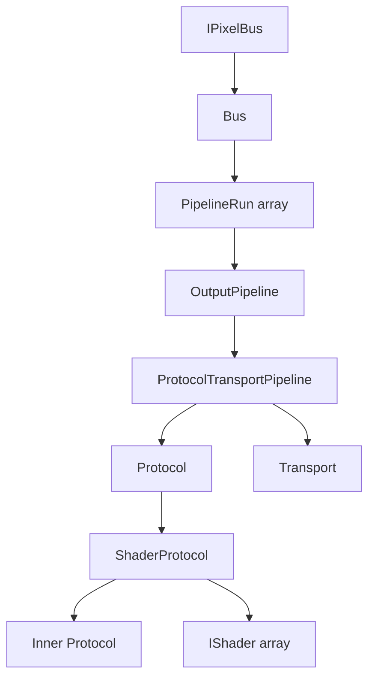

# Bus Builder & Lifetime Simplification

> **Purpose:** Provide a single-owner, cascading-lifetime root entity (the "Bus Builder") that simplifies construction of both single-pipeline and composite multi-pipeline `IPixelBus` instances, eliminating manual wiring of 7–10 interdependent objects.
>
> **Companion usage doc:** [bus-builder.md](../../usage/bus-builder.md) — the target-state API contract and usage rules.

## Status Legend

| Status | Meaning |
|--------|---------|
| `todo` | Not yet started |
| `doing` | In progress |
| `done` | Completed |
| `blocked` | Blocked on external dependency |
| `deferred` | Intentionally postponed |

## Source Documents

| Category | File | Key Symbols |
|----------|------|-------------|
| Bus — interface | `src/core/IPixelBus.h` | `lw::IPixelBus` |
| Bus — composite | `src/buses/Bus.h` | `lw::buses::Bus`, `lw::buses::PipelineRun` |
| Bus — dynamic template | `src/buses/PixelBus.h` | `lw::buses::PixelBus<TProtocol, TTransport, ...TShaders>` |
| Bus — static template | `src/buses/StackPixelBus.h` | `lw::buses::StackPixelBus<NPixelCount, TProtocol, TTransport, ...TShaders>` |
| Bus — convenience header | `src/buses/Busses.h` | — |
| Pipeline | `src/buses/ProtocolTransportPipeline.h` | `lw::buses::ProtocolTransportPipeline` |
| Protocol | `src/protocols/Protocol.h` | `lw::protocols::Protocol`, `lw::protocols::ProtocolSettings` |
| Shader protocol | `src/protocols/ShaderProtocol.h` | `lw::protocols::ShaderProtocol` |
| Shader interface | `src/protocols/IShader.h` | `lw::protocols::IShader` |
| Transport | `src/transports/Transport.h` | `lw::transports::Transport`, `lw::transports::TransportSettingsBase` |
| Output pipeline | `src/core/OutputPipeline.h` | `lw::OutputPipeline` |
| Color / span | `src/core/Compat.h` | `lw::Pixel`, `lw::span`, `lw::PixelCount` |
| Tests — Bus | `test/busses/test_bus/test_main.cpp` | Manual `Bus` + `PipelineRun` construction |
| Tests — StackPixelBus | `test/busses/test_pixel_bus/test_main.cpp` | Static template construction |
| Tests — PixelBus | `test/busses/test_pixel_bus_dynamic/test_main.cpp` | Dynamic template construction |
| Inventory | `docs/internal/platform-transport-inventory.md` | Full transport catalog |
| Presets (planned) | `src/protocols/*Preset.h`, `src/transports/*Preset.h` | `lw::buses::presets` structs with `configure(BusBuilder&)` |
| Reference: NeoPixelBus | `NeoPixelBus.h` (Makuna) | `T_COLOR_FEATURE` + `T_METHOD` composition, `NeoGrbFeature`, `Neo800KbpsMethod` |

## Current State

### Architecture Overview

The LumaWave bus architecture composes pixels → protocol → transport through a chain of four layers:



`Bus` (`src/buses/Bus.h`) is the concrete terminal: it holds a `span<Pixel>` for pixel storage and a `span<const PipelineRun>`. Each `PipelineRun` pairs an `OutputPipeline*` with a length. On `show()`, the bus slices the pixel span by run length and delegates to each pipeline's `write()`.

`ProtocolTransportPipeline` (`src/buses/ProtocolTransportPipeline.h`) bridges protocol and transport: `write()` calls `Protocol::update()` to encode colors → bytes, then `Transport::transmitBytes()` to push bytes to hardware. It holds three references — `Protocol&`, `Transport&`, and `span<uint8_t>` protocol buffer.

`ShaderProtocol` (`src/protocols/ShaderProtocol.h`) is a decorator that interposes shaders between the caller and the inner protocol: it applies each `IShader::apply()` in sequence through a scratch pixel buffer, then passes the result to the inner protocol.

### Current Construction Approaches

**Approach A: Manual (low-level)**

The `Bus` class only takes references/views — it owns nothing. Users must manually allocate and keep alive:

```cpp
// All of these must live as long as the Bus:
std::array<lw::Pixel, 30> pixels{};
Ws2812xProtocol protocol(30);
NilTransport transport;
std::vector<uint8_t> protoBuf(Ws2812xProtocol::requiredBufferSize(30));
ProtocolTransportPipeline pipeline(protocol, transport, protoBuf);
PipelineRun runs[] = {{&pipeline, 30}};
Bus bus(pixels, runs);
```

This is 7 distinct allocations/objects with tangled lifetimes. Adding shaders adds: a `ShaderProtocol`, a `tuple<TShaders...>`, a `vector<IShader*>`, and a `vector<Color>` scratch buffer — bringing the total to 11 objects.

**Approach B: `PixelBus` template (dynamic, heap)**

`PixelBus<TProtocol, TTransport, ...TShaders>` (`src/buses/PixelBus.h`) owns everything by value. Its constructor initializer list creates 10+ members in dependency order:

```cpp
PixelBus(size_t pixelCount, ProtocolSettings ps, TransportSettings ts)
    : _pixelCount(pixelCount)
    , _pixels(pixelCount)
    , _protocol(pixelCount, ps)
    , _transport(std::move(ts))
    , _protocolBuffer(TProtocol::requiredBufferSize(...))
    , _scratchPixels(HasShaders ? pixelCount : 0)
    , _shaders{}                                           // tuple
    , _shaderPtrs(sizeof...(TShaders))                     // vector<IShader*>
    , _shaderProto(_protocol, _shaderPtrs, _scratchPixels) // ShaderProtocol
    , _pipeline(_shaderProto, _transport, _protocolBuffer) // ProtocolTransportPipeline
    , _run{&_pipeline, pixelCount}                         // PipelineRun
    , _bus(_pixels, span{&_run, 1})                        // Bus
{}
```

Two constructor overloads exist: default-constructed shaders vs. `std::tuple`-arg shaders. The member initialization order is fragile — `_shaderProto` must come after `_shaders`, `_shaderPtrs`, and `_scratchPixels`; `_pipeline` must come after `_shaderProto`, `_transport`, and `_protocolBuffer`; `_bus` must come last.

**Approach C: `StackPixelBus` template (static, stack)**

`StackPixelBus<NPixelCount, TProtocol, TTransport, ...TShaders>` (`src/buses/StackPixelBus.h`) is identical to `PixelBus` but uses `std::array` and C-arrays instead of `std::vector`, with all sizes known at compile time.

### Pain Points

1. **Fragile init-order dependency.** The 10+ members in `PixelBus`/`StackPixelBus` must be declared in strict order. A reordering breaks the initializer list — a subtle bug that compiles but produces dangling references at runtime.

2. **Duplicate constructor overloads.** Every addition to the shader pipeline requires two constructor overloads (default + tuple-arg). The template machinery (`std::make_from_tuple`, `std::index_sequence`) is opaque.

3. **No multi-strip support in PixelBus/StackPixelBus.** These templates hardcode a single `PipelineRun` and a single `ProtocolTransportPipeline`. To drive multiple strips from one pixel buffer, the user must drop down to manual `Bus` construction.

4. **No transport/protocol sharing.** Each `PixelBus`/`StackPixelBus` owns its protocol and transport by value. Two strips sharing a clock line cannot share a transport instance.

5. **No gradual construction.** The entire bus must be fully specified at construction time. There is no way to add shaders, change settings, or add runs after construction.

## Problem Statement

Constructing a complete `IPixelBus` requires allocating and wiring 7–11 interdependent objects with strict lifetime ordering. The `PixelBus` and `StackPixelBus` templates encapsulate this but at the cost of:

- **Fragile member ordering** — the initializer list is a single point of failure for 10+ dependencies.
- **Template explosion** — the shader parameter pack propagates through every layer, making error messages and IDE tooltips unwieldy.
- **No composition reuse** — a multi-strip scenario requires abandoning the templates entirely and hand-wiring with raw `Bus`.
- **Duplicated logic** — `PixelBus` and `StackPixelBus` differ only in allocation strategy (vector vs. array) but have near-identical code.

These costs make it harder to add new bus topologies (e.g., matrix, serpentine), harder to write examples, and harder to test in isolation.

## Design Goals

1. **Single-owner cascade.** A single root object owns all sub-objects. Destroying the root cleanly destroys every owned buffer, shader, protocol, transport, and pipeline. No dangling references.

2. **Builder-style incremental construction.** Users can add shaders, set settings, and attach runs step-by-step before finalizing. Finalization validates the configuration and produces an `IPixelBus`.

3. **Unified static/dynamic allocation.** A single API surface supports both compile-time-sized (stack/static) and runtime-sized (heap/dynamic) allocation, without duplicating all template logic.

4. **Multi-run (composite) support.** The same API should handle single-strip and multi-strip (aggregate) cases, including the ability to share a transport or protocol across runs.

5. **Non-breaking.** Existing `PixelBus`, `StackPixelBus`, `Bus`, `ProtocolTransportPipeline`, `Protocol`, `Transport`, and `IShader` types remain unchanged and fully functional. The new system is additive.

6. **Testable in isolation.** Each layer (storage allocation, pipeline construction, bus finalization) should be independently testable via the native CMake test suite.

7. **Clear error messages.** Misconfiguration (e.g., forgetting to attach a transport) should produce a comprehensible compile-time or runtime error, not a cryptic template backtrace.

8. **External pixel buffer support.** Allow callers to provide a pre-allocated pixel buffer that the bus writes into directly, enabling zero-copy integration with frameworks (e.g., WLED) that manage their own LED buffer arrays. The external buffer path must not force a heap allocation for pixel storage.

9. **Discoverable protocol/transport presets.** Common chip+transport combinations should be available as named convenience functions so users don't need to know which `Protocol` subclass and `Transport` subclass to pair. Inspired by NeoPixelBus's `NeoGrbFeature` + `Neo800KbpsMethod` pattern, presets collapse the two-axis choice (what chip? what hardware?) into discoverable one-liners.

## Non-Goals

- **No modification to `Protocol` or `Transport` base classes.** These are stable seams; the builder wraps them, it does not change them.
- **No runtime polymorphism overhead on the hot path.** After construction/finalization, the resulting `IPixelBus` should have the same call-graph cost as today's `PixelBus`/`Bus`.
- **No dynamic allocation forced on embedded targets.** Stack-only construction must remain available for `-fno-rtti -fno-exceptions` embedded builds.
- **No replacement of `IShader`.** The shader interface and `ShaderProtocol` decorator remain unchanged.
- **No serialization or configuration-file support.** The builder is a C++ API, not a JSON/YAML parser.

## Recommended End State

### New Type: `lw::buses::BusBuilder`

A builder class that incrementally accumulates configuration and owns all heap-allocated intermediates. Finalization produces an `IPixelBus` backed by a single-owner storage object.

```cpp
namespace lw::buses
{

class BusBuilder
{
public:
    // --- Pixel storage ---

    /// Set dynamic pixel count. Allocates pixel storage internally.
    BusBuilder& setPixelCount(size_t count);

    /// Use externally-owned pixel storage. The builder does not allocate pixel memory.
    /// Mutually exclusive with setPixelCount(). The provided span must outlive
    /// the returned IPixelBus. Pixel count is inferred from span.size().
    BusBuilder& setPixelStorage(span<Pixel> externalPixels);

    // --- Transport ---

    /// Attach a transport by move. The builder takes ownership.
    template<typename TTransport>
    BusBuilder& setTransport(TTransport transport, typename TTransport::TransportSettingsType settings = {});

    // --- Protocol ---

    /// Attach a protocol by move. The builder takes ownership.
    template<typename TProtocol>
    BusBuilder& setProtocol(TProtocol protocol, typename TProtocol::SettingsType settings = {});

    // --- Shaders ---

    /// Add a shader. Shaders apply in insertion order.
    template<typename TShader>
    BusBuilder& addShader(TShader shader);

    // --- Preset strips ---

    /// Add a strip using presets. Sets protocol+transport on the builder.
    /// For single-strip buses this is all you need; build() handles the run.
    template<typename TProtoPreset, typename TTransPreset>
    BusBuilder& addStrip(TProtoPreset protocol, TTransPreset transport);

    /// Add a strip with shader preset.
    template<typename TProtoPreset, typename TTransPreset, typename TShaderPreset>
    BusBuilder& addStrip(TProtoPreset protocol, TTransPreset transport, TShaderPreset shader);

    /// Add a run with explicit pixel offset and length (multi-strip).
    /// Equivalent to: addRun(pixelOffset, length); addStrip(protocol, transport);
    template<typename TProtoPreset, typename TTransPreset>
    BusBuilder& addStrip(size_t pixelOffset, size_t length, TProtoPreset protocol, TTransPreset transport);

    /// Add a run with offset, length, and shader preset.
    /// Equivalent to: addRun(pixelOffset, length); addStrip(protocol, transport, shader);
    template<typename TProtoPreset, typename TTransPreset, typename TShaderPreset>
    BusBuilder& addStrip(size_t pixelOffset, size_t length, TProtoPreset protocol, TTransPreset transport, TShaderPreset shader);

    // --- Runs (low-level, for manual protocol/transport) ---

    /// Add a run referencing the most recently set protocol+transport pair.
    /// For single-strip, this is called implicitly by build().
    BusBuilder& addRun(size_t pixelOffset, size_t length);

    // --- Finalization ---

    /// Validate and build. Returns a heap-allocated IPixelBus.
    /// The builder is consumed (moved-from) after this call.
    std::unique_ptr<IPixelBus> build();

    // --- Static variant ---

    /// Build into caller-provided storage. Returns a reference to the bus.
    /// Storage type must satisfy BusStorage concept (pixels, buffers, etc.).
    template<typename TStorage>
    IPixelBus& buildInto(TStorage& storage);

private:
    // ... internal type-erased storage for transport, protocol, shaders, buffers ...
};

} // namespace lw::buses
```

### Usage Examples

**Single strip with presets (recommended):**

```cpp
using namespace lw::buses::presets;

auto bus = lw::buses::BusBuilder()
    .setPixelCount(30)
    .addStrip(ws2812x{}, spi{})
    .build();

bus->begin();
bus->pixels()[0] = lw::pixelFromRGB(255, 0, 0);
bus->show();
```

**Single strip with presets + shader:**

```cpp
using namespace lw::buses::presets;

auto bus = lw::buses::BusBuilder()
    .setPixelCount(60)
    .addStrip(apa102{}, rp_pio{2}, brightness{128})
    .build();
```

**Multi-strip with presets:**

```cpp
using namespace lw::buses::presets;

auto bus = lw::buses::BusBuilder()
    .setPixelCount(90)                   // 30 + 60 total
    .addStrip(0, 30, ws2801{}, spi{})     // Strip 1: pixels [0, 30)
    .addStrip(30, 60, ws2812x{}, rp_pio{3}, gamma{2.2f})  // Strip 2
    .build();
```

**Inline field override + transport settings:**

```cpp
using namespace lw::buses::presets;

auto bus = lw::buses::BusBuilder()
    .setPixelCount(60)
    .addStrip(ws2812x{.channelOrder = "RGB"},
              spi{.settings = {.clockRateHz = 2000000, .dataMode = SpiMode0}})
    .build();
```

**Explicit construction (no presets):**

```cpp
auto bus = lw::buses::BusBuilder()
    .setPixelCount(30)
    .setTransport(lw::transports::SpiTransport{})
    .setProtocol(lw::protocols::Ws2812xProtocol{}, {})
    .build();

bus->begin();
bus->pixels()[0] = lw::pixelFromRGB(255, 0, 0);
bus->show();
```

**External pixel storage (zero-copy, WLED-compatible):**

```cpp
std::array<lw::Pixel, 90> ledStrip{};

using namespace lw::buses::presets;
auto bus = lw::buses::BusBuilder()
    .setPixelStorage(ledStrip)
    .addStrip(ws2812x{}, rp_pio{2})
    .build();
// bus->pixels() returns a span referencing ledStrip directly.
// ledStrip must outlive bus
```

**Static/stack allocation:**

```cpp
lw::buses::StackBusStorage<90,
    lw::protocols::Ws2812xProtocol,
    lw::transports::RpPioTransport> storage;

using namespace lw::buses::presets;
auto& bus = lw::buses::BusBuilder()
    .setPixelCount(90)
    .addStrip(ws2812x{}, rp_pio{2})
    .buildInto(storage);

bus.begin();
bus.pixels()[0] = lw::pixelFromRGB(255, 0, 255);
bus.show();
```

### Protocol, Transport, and Shader Presets

NeoPixelBus composes two orthogonal template parameters — **Color Feature** (RGB, GRB, BGR, WRGB byte order) and **Method** (800Kbps, 400Kbps, DotStar SPI, DMA) — into well-known combinations like `NeoPixelBus<NeoGrbFeature, Neo800KbpsMethod>`. Users pick from a catalog of named types rather than wiring raw protocol settings.

LumaWave's analog keeps protocol and transport **separate** — the user always chooses them independently — and uses the **configure** pattern: a preset is any type with a `configure(BusBuilder&)` method. `BusBuilder::addStrip()` calls `configure()` on each preset in the correct order, injecting the preset's settings into the builder.

**Preset Concept (SFINAE gate):**

```cpp
// A type is a Preset if it has configure(BusBuilder&).
// All presets — protocol, transport, shader — use the same contract.
// They are distinguished by role (argument position in addStrip), not by type tag.

template<typename T, typename = void>
struct is_preset : std::false_type {};

template<typename T>
struct is_preset<T, std::void_t<decltype(std::declval<T&>().configure(std::declval<BusBuilder&>()))>>
    : std::true_type {};
```

**Preset Catalog** — each preset lives alongside its target type:

| Preset | File | What it configures |
|--------|------|--------------------|
| `ws2812x` | `src/protocols/Ws2812xPreset.h` | `Ws2812xProtocol` with GRB color order |
| `ws2812x_rgb` | `src/protocols/Ws2812xPreset.h` | `Ws2812xProtocol` with RGB color order |
| `ws2812x_wrgb` | `src/protocols/Ws2812xPreset.h` | `Ws2812xProtocol` with WRGB color order |
| `dotstar` | `src/protocols/DotStarPreset.h` | `DotStarProtocol` with BGR color order |
| `apa102` | `src/protocols/Apa102Preset.h` | `Apa102Protocol` with BGR color order |
| `ws2801` | `src/protocols/Ws2801Preset.h` | `Ws2801Protocol` with RGB color order |
| `lpd8806` | `src/protocols/Lpd8806Preset.h` | `Lpd8806Protocol` with GRB color order |
| `tm1814` | `src/protocols/Tm1814Preset.h` | `Tm1814Protocol` with WRGB color order |
| `p9813` | `src/protocols/P9813Preset.h` | `P9813Protocol` with BGR color order |
| `spi` | `src/transports/SpiPreset.h` | `SpiTransport` |
| `rp_pio` | `src/transports/RpPioPreset.h` | `RpPioTransport` |
| `brightness` | `src/protocols/BrightnessShader.h` (or dedicated preset header) | `BrightnessShader` |
| `gamma` | `src/protocols/GammaShader.h` (or dedicated preset header) | `GammaShader` |

Aggregate convenience headers (`src/protocols/ProtocolPresets.h`, `src/transports/TransportPresets.h`) collect all presets for each category.

All presets are in namespace `lw::buses::presets`:

```cpp
namespace lw::buses::presets
{

// --- Protocol presets ---

struct ws2812x {
    const char* channelOrder = ChannelOrder::GRB::value;
    void configure(BusBuilder& b) {
        b.setProtocol(protocols::Ws2812xProtocol{},
            Ws2812xProtocolSettings{.channelOrder = channelOrder});
    }
};

struct ws2812x_rgb {
    void configure(BusBuilder& b) {
        b.setProtocol(protocols::Ws2812xProtocol{},
            Ws2812xProtocolSettings{.channelOrder = ChannelOrder::RGB::value});
    }
};

struct ws2812x_wrgb {
    void configure(BusBuilder& b) {
        b.setProtocol(protocols::Ws2812xProtocol{},
            Ws2812xProtocolSettings{.channelOrder = ChannelOrder::WRGB::value});
    }
};

struct dotstar {
    void configure(BusBuilder& b) { b.setProtocol(protocols::DotStarProtocol{}, {}); }
};

struct apa102 {
    void configure(BusBuilder& b) { b.setProtocol(protocols::Apa102Protocol{}, {}); }
};

struct ws2801 {
    void configure(BusBuilder& b) { b.setProtocol(protocols::Ws2801Protocol{}, {}); }
};

struct lpd8806 {
    void configure(BusBuilder& b) { b.setProtocol(protocols::Lpd8806Protocol{}, {}); }
};

struct tm1814 {
    void configure(BusBuilder& b) { b.setProtocol(protocols::Tm1814Protocol{}, {}); }
};

struct p9813 {
    void configure(BusBuilder& b) { b.setProtocol(protocols::P9813Protocol{}, {}); }
};

// --- Transport presets ---

struct spi {
    transports::SpiTransportSettings settings{};
    void configure(BusBuilder& b) { b.setTransport(transports::SpiTransport{}, settings); }
};

struct rp_pio {
    int pin = -1;
    transports::RpPioTransportSettings settings{};
    void configure(BusBuilder& b) {
        settings.dataPin = pin;
        b.setTransport(transports::RpPioTransport{}, settings);
    }
};

// --- Shader presets ---

struct brightness {
    uint8_t level = 255;
    void configure(BusBuilder& b) { b.addShader(protocols::BrightnessShader{level}); }
};

struct gamma {
    float value = 2.2f;
    void configure(BusBuilder& b) { b.addShader(protocols::GammaShader{value}); }
};

} // namespace lw::buses::presets
```

**Key design properties:**

- **Protocol and transport are never bundled.** The user always picks both independently: `addStrip(ws2812x{}, rp_pio{2})`.
- **Presets are plain structs with public fields.** Default values can be overridden inline: `addStrip(ws2812x{.channelOrder = "RGB"}, rp_pio{.pin = 5})`.
- **Presets live alongside their target types.** Protocol presets in `src/protocols/`, transport presets in `src/transports/`. Aggregate headers (`ProtocolPresets.h`, `TransportPresets.h`) collect them.
- **Composable.** Any third-party code can define a preset by providing `configure(BusBuilder&)` — no inheritance required.
- **Non-breaking.** `setTransport`/`setProtocol`/`addRun` remain the explicit low-level path.
- **`addStrip` with offset+length is a wrapper** around `addRun(offset, length)` followed by the matching non-offset `addStrip`.
- **SFINAE-friendly.** Single `is_preset<T>` gate gives clear compile errors if a non-preset type is passed to `addStrip`.

**Comparison to NeoPixelBus:**

| Concept | NeoPixelBus | LumaWave |
|---------|-------------|----------|
| Color order | `T_COLOR_FEATURE` template param (`NeoGrbFeature`) | `channelOrder` field on protocol preset struct |
| Protocol timing | `T_METHOD` template param (`Neo800KbpsMethod`) | Chosen by which protocol preset struct is used |
| Transport hardware | Bundled inside `T_METHOD` | Separate transport preset struct (`spi`, `rp_pio`) |
| Convenience | `NeoPixelBus<Feature, Method>` typedef | `addStrip(ws2812x{}, rp_pio{2})` |

### Internal Architecture

The builder uses type erasure internally to avoid template propagation across the builder chain:

```mermaid
graph TD
    subgraph "User-facing (templated)"
        A[BusBuilder::setTransport&lt;T&gt;]
        B[BusBuilder::setProtocol&lt;T&gt;]
        C[BusBuilder::addShader&lt;T&gt;]
        D[BusBuilder::addStrip&lt;Proto,Trans,Shader&gt;]
        E[BusBuilder::addRun]
        F[BusBuilder::build / buildInto]
    end

    subgraph "Internal (type-erased)"
        G[TransportHolder]
        H[ProtocolHolder]
        I[ShaderList]
        J[BufferManager]
        K[BusStorage concept]
    end

    subgraph "Result"
        L[IPixelBus*]
        M[Bus + PipelineRun array + ProtocolTransportPipeline(s)]
    end

    A --> G
    B --> H
    C --> I
    D --> G
    D --> H
    D --> I
    E --> J
    F --> K --> M --> L
```

### Ownership Model

```
BusBuilder (during construction)
├── TransportHolder ── owns unique_ptr<Transport>
├── ProtocolHolder ── owns unique_ptr<Protocol>
├── ShaderList ── owns vector<unique_ptr<IShader>>
├── BufferManager ── owns protocol buffer(s) + scratch pixel buffer
├── Pipeline descriptions ── vector of {offset, length, transport_index, protocol_index}
└── Pixel storage ── vector<Color>

After build():
  BusStorage (single-owner RAII object)
  ├── vector<Color> pixels
  ├── vector<uint8_t> protocolBuffer(s)
  ├── vector<Color> scratchPixels
  ├── tuple<TShaders...> shaders
  ├── vector<IShader*> shaderPtrs
  ├── ShaderProtocol
  ├── ProtocolTransportPipeline (one per run)
  ├── vector<PipelineRun> runs
  └── Bus
```

The `BusStorage` object is heap-allocated by `build()` and returned as `unique_ptr<IPixelBus>`. For `buildInto()`, the caller provides a `StackBusStorage<N, ...>` which is a POD-like struct with compile-time-sized arrays.

### StackBusStorage Concept

```cpp
template<size_t NPixelCount, typename TProtocol, typename TTransport, typename... TShaders>
struct StackBusStorage
{
    // Compile-time-computed sizes
    static constexpr size_t kProtocolBufferSize = TProtocol::requiredBufferSize(NPixelCount, {});

    lw::Pixel pixels[NPixelCount]{};
    uint8_t protocolBuffer[kProtocolBufferSize]{};
    lw::Pixel scratchPixels[sizeof...(TShaders) > 0 ? NPixelCount : 1]{};
    std::tuple<TShaders...> shaders{};
    lw::protocols::IShader* shaderPtrs[sizeof...(TShaders)]{};
    TProtocol protocol;
    TTransport transport;
    lw::protocols::ShaderProtocol shaderProto;
    lw::buses::ProtocolTransportPipeline pipeline;
    lw::buses::PipelineRun runs[1];
    lw::buses::Bus bus;

    StackBusStorage()
        : protocol(NPixelCount)
        , shaderProto(protocol, shaderPtrs, scratchPixels)
        , pipeline(shaderProto, transport, protocolBuffer)
        , runs{{&pipeline, NPixelCount}}
        , bus(lw::span<lw::Pixel>{pixels}, lw::span<const lw::buses::PipelineRun>{runs})
    {}

    // Non-copyable, non-movable (internal references would dangle)
    StackBusStorage(const StackBusStorage&) = delete;
    StackBusStorage& operator=(const StackBusStorage&) = delete;
};
```

`StackBusStorage` is a code-gen candidate (could be produced by a macro or `constexpr` generator) since it mirrors the exact member dependency order of today's `StackPixelBus`. The key improvement is that it's decoupled from the builder — the builder populates it via `buildInto()` rather than the struct being a self-contained template monolith.

### Migration Path

The plan is additive:

1. Introduce `BusBuilder` and `BusStorage` alongside existing types.
2. Port examples (`examples/hello/ws2812/`, `examples/hello/apa102/`) to use the builder. Validate ergonomics.
3. Add multi-strip examples using `addRun()`.
4. Optionally deprecate `PixelBus` and `StackPixelBus` once the builder has equivalent coverage.
5. The existing `Bus`, `ProtocolTransportPipeline`, `Protocol`, `Transport`, `IShader` remain unchanged throughout.

## Open Decisions

| ID | Status | Decision | Notes |
|----|--------|----------|-------|
| BBL-DEC-1 | `done` | Should `BusBuilder` be move-only (unique ownership) or support copy? | **Move-only.** Simpler, matches single-owner goal. Copy would require deep-cloning type-erased transports — problematic for hardware resources. |
| BBL-DEC-2 | `done` | Should `StackBusStorage` be hand-authored per permutation or generated? | **Hand-authored for now.** A code-gen script or `constexpr` factory can follow if the pattern stabilizes. |
| BBL-DEC-3 | `done` | Should `build()` return `unique_ptr<IPixelBus>` or a concrete `BusStorage` by value? | **`unique_ptr<IPixelBus>`.** Preserves interface abstraction and keeps the storage object opaque. |
| BBL-DEC-4 | `done` | Should the builder support sharing transports across runs? | **No.** Each run gets its own transport. Transport settings (e.g., pins, clock rate) differ per run in multi-strip scenarios. |
| BBL-DEC-5 | `done` | Should `BusBuilder` use `std::any` / `std::function` for type erasure, or a custom vtable approach? | **Custom vtable.** Avoids RTTI and exception overhead for `-fno-rtti -fno-exceptions` embedded targets. A hand-rolled `TransportHolder` with a `unique_ptr<TransportBase>` + move-only semantics. |
| BBL-DEC-6 | `done` | What is the error handling strategy for `build()`? | **Return `nullptr` on failure.** The builder also exposes a `validate()` method for early checking without allocation. |
| BBL-DEC-7 | `done` | Should `setPixelStorage()` and `setPixelCount()` be mutually exclusive, or should `setPixelStorage()` override `setPixelCount()`? | **Mutual exclusion.** Calling both is rejected at runtime. `StackBusStorage` owns pixel memory by definition; external pixels would need a separate `StackBusStorageNoPixels` concept. |
| BBL-DEC-8 | `done` | Should `addStrip` SFINAE use a single `is_preset<T>` gate or separate `is_protocol_preset` / `is_transport_preset` tags? | **Single `is_preset` restriction.** Presets are distinguished by argument position. A `preset_category` typedef can be added later if stronger type safety is needed, without breaking the `configure()` contract. |
| BBL-DEC-9 | `done` | Should preset structs live in `lw::buses::presets` or be declared alongside protocol/transport headers? | **Alongside protocol/transport headers.** Protocol presets in `src/protocols/` (e.g., `Ws2812xPreset.h`), transport presets in `src/transports/` (e.g., `SpiPreset.h`). Convenience aggregate headers (`ProtocolPresets.h`, `TransportPresets.h`) collect them. |
| BBL-DEC-10 | `done` | Should `addStrip` without offset+length always defer the run to `build()`, or add it eagerly? | **Non-offset overloads defer; offset+length overloads eagerly add the run.** The offset+length overloads are simple wrappers: `addRun(offset, length)` followed by the matching non-offset `addStrip(protocol, transport, shader?)`. Single-strip builds rely on `build()` for the implicit run. |
