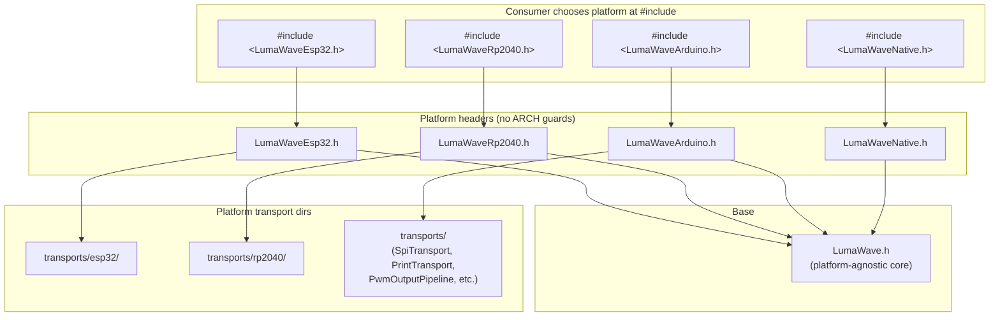

# Platform Transport Abstraction

> **Purpose:** Eliminate all `#if defined(ARDUINO_ARCH_*)` guards from the library by giving each platform its own top-level header. The consumer chooses their platform at the `#include` line.

## Status Legend

| Status   | Meaning                                        |
|----------|------------------------------------------------|
| `todo`   | Not yet started                                |
| `doing`  | In progress                                    |
| `done`   | Complete                                       |
| `blocked`| Waiting on external dependency                 |
| `deferred`| Explicitly postponed for a later phase         |

## Source Documents

| Category | File | Relevance |
|----------|------|-----------|
| Inventory | `docs/internal/platform-transport-inventory.md` | Catalog of all transport/output-pipeline implementations |
| Core | `src/core/Compat.h` | Platform detection (`LW_HAS_ARDUINO`, `LW_HAS_SPI_TRANSPORT`), SPI defaults |
| Core | `src/core/OutputPipeline.h` | Light-driver base class |
| Aggregation | `src/transports/Transports.h` | Current `#if` chain for `PlatformDefaultLightDriver`, per-platform includes |
| Base | `src/transports/Transport.h` | `Transport` base class, `TransportSettingsBase`, SPI constants |
| Base | `src/transports/NilTransport.h` | No-op transport for tests and placeholders |
| Aggregation | `src/LumaWave.h` | Current top-level header — will become platform-agnostic base |

---

## Current State

The platform-specific transport implementations (`rp2040/RpPioTransport`, `esp32/Esp32RmtTransport`, etc.) are **planned but not yet implemented**. The inventory document lists 12 items across 4 platform families.

The existing `src/transports/Transports.h` aggregation header uses bare `#if` chains:

```cpp
// src/transports/Transports.h (current)
#if defined(ARDUINO_ARCH_NRF52840)
#include "transports/nrf52/Nrf52PwmOneWireTransport.h"
#endif

namespace lw::transports
{
#if defined(ARDUINO_ARCH_RP2040)
using PlatformDefaultLightDriver = lw::transports::rp2040::RpPwmLightDriver;
#elif defined(ARDUINO_ARCH_ESP32)
using PlatformDefaultLightDriver = lw::transports::esp32::Esp32SigmaDeltaLightDriver;
#elif defined(ARDUINO_ARCH_ESP8266)
using PlatformDefaultLightDriver = lw::transports::esp8266::Esp8266LedcLightDriver;
#else
using PlatformDefaultLightDriver = lw::OutputPipeline;
#endif
}
```

The same pattern exists in `src/palettes/Generators.h`.

### Pain points

1. **Scattered guards.** Platform `#if` chains are spread across multiple files. Adding a new platform means touching every file with a chain.
2. **Magic behavior.** `#include <LumaWave.h>` silently decides what's available based on compiler macros. The consumer can't tell what they're getting.
3. **No single source of truth.** There is no canonical, readable list of which transports exist on which platform.
4. **Test friction.** Native tests must guard against including platform headers that pull in MCU SDKs.

---

## Problem Statement

As the transport inventory grows to 12+ implementations across 4-5 platform families, the `#if defined(ARDUINO_ARCH_*)` pattern creates hidden coupling: the consumer gets different types from the same `#include` depending on their toolchain. This is fragile, hard to document, and makes it impossible to compile-check cross-platform code without the target SDK installed.

---

## Design Goals

1. **Zero `#if defined(ARDUINO_ARCH_*)` guards in the library.** No header in `src/` uses platform-detection macros to decide what to include or define.
2. **Consumer explicitly chooses platform.** The `#include` line declares the target. No magic.
3. **Each platform header is self-documenting.** Opening `LumaWaveEsp32.h` tells you exactly what ESP32 transports are available.
4. **Clean compile errors on mismatch.** If you include `LumaWaveEsp32.h` and compile for RP2040, you get an immediate, clear error from the missing SDK headers — not a silent fallback to NilTransport.
5. **Testable on native.** Native tests include `LumaWaveNative.h` which brings in NilTransport only. No platform SDKs needed.
6. **Platform transports use native SDKs directly.** `RpPioTransport` includes `<hardware/pio.h>`, not `<Arduino.h>`. `Esp32RmtTransport` includes `<driver/rmt.h>`, not `<Arduino.h>`. Platform-native transports do not depend on the Arduino compatibility layer — they talk to the hardware through the vendor SDK. This keeps them usable outside the Arduino ecosystem (e.g., pure Pico SDK or ESP-IDF projects) and avoids layering violations where a transport silently relies on `digitalWrite()` or `SPI.begin()` behind the scenes.

---

## Non-Goals

- This plan does **not** change the `Transport` or `OutputPipeline` base class interfaces.
- This plan does **not** change the `Bus` / `BusBuilder` / `ProtocolTransportPipeline` architecture.
- This plan does **not** remove `Compat.h` capability flags (`LW_HAS_SPI_TRANSPORT`, etc.) — those are still useful for Arduino-abstraction transports like `SpiTransport` and `PrintTransport` that work across all Arduino platforms.
- This plan does **not** change the implementation of platform transports to remove their native SDK dependencies — that is already the intended design. The plan codifies the rule that platform transports (`rp2040/`, `esp32/`, etc.) include vendor SDK headers directly, never `<Arduino.h>`.
- This plan does **not** address `Generators.h` random-number platform selection — that is a separate (though related) concern.

---

## Recommended End State

### Core idea: Platform-specific top-level headers

The consumer picks their platform by which header they include:

```cpp
#include <LumaWaveEsp32.h>     // ESP32: RMT, DMA SPI, sigma-delta light driver
#include <LumaWaveRp2040.h>    // RP2040: PIO, hardware SPI, UART, PWM light driver
#include <LumaWaveArduino.h>   // Generic Arduino: SPI, PWM, Print transports
#include <LumaWaveNative.h>    // Native: NilTransport only (for tests)
```

`LumaWave.h` becomes the platform-agnostic base — it includes the core types (Pixel, Palette, Protocol base, Bus, Topology) and NilTransport, but **no** platform-specific or Arduino-abstraction transports. Each `LumaWave<Platform>.h` includes `LumaWave.h` plus that platform's transports.

`LumaWaveArduino.h` is the odd one out: instead of targeting a specific MCU architecture, it bundles the Arduino-abstraction transports (`SpiTransport`, `PwmOutputPipeline`, `PrintTransport`, `PrintOutputPipeline`) that work across all Arduino platforms. It's gated by `LW_HAS_*` capability flags, not architecture macros, and is useful for sketches that want generic Arduino APIs rather than platform-specific hardware peripherals.

### Clean separation: native SDK vs. Arduino abstraction

There are two distinct categories of transports, and they must not be mixed:

| Category | Header | Depends on | Example |
|----------|--------|------------|---------|
| **Platform-native** | `LumaWaveRp2040.h`, `LumaWaveEsp32.h`, etc. | Vendor SDK only (Pico SDK, ESP-IDF). **No `<Arduino.h>`.** | `RpPioTransport` includes `<hardware/pio.h>` |
| **Arduino-abstraction** | `LumaWaveArduino.h` | Arduino SDK (`<Arduino.h>`, `<SPI.h>`, `Print`). Works on any Arduino core. | `SpiTransport` calls `SPI.transfer()` |

A platform-native transport must never include `<Arduino.h>` or call Arduino APIs (`digitalWrite`, `SPI.begin`, `analogWrite`, `Serial.print`). If a transport needs those, it belongs in the Arduino-abstraction category under `LumaWaveArduino.h`.

This separation means:
- Platform transports are usable in **non-Arduino** projects (pure Pico SDK, pure ESP-IDF).
- Arduino-abstraction transports are usable on **any** Arduino-compatible board, regardless of architecture.
- There is no hidden Arduino dependency in a platform header — if you see `#include <LumaWaveRp2040.h>`, you know it only pulls in Pico SDK.



### File structure

```
src/
├── LumaWave.h                  # platform-agnostic base (no guards, no Arduino abstractions)
├── LumaWaveEsp32.h             # ESP32: base + Esp32RmtTransport, Esp32DmaSpiTransport, Esp32SigmaDeltaLightDriver
├── LumaWaveRp2040.h            # RP2040: base + RpPioTransport, RpSpiTransport, RpUartTransport, RpPwmLightDriver
├── LumaWaveEsp8266.h           # ESP8266: base + Esp8266LedcLightDriver
├── LumaWaveNrf52.h             # NRF52: base + Nrf52PwmOneWireTransport
├── LumaWaveArduino.h           # Generic Arduino: base + SpiTransport, PwmOutputPipeline, PrintTransport, PrintOutputPipeline
├── LumaWaveNative.h            # Native/test: base + NilTransport only
│
├── transports/
│   ├── Transport.h             # base class
│   ├── NilTransport.h          # no-op (always available)
│   ├── NilTransportPreset.h
│   ├── PrintTransport.h        # Arduino-abstraction (available when LW_HAS_ARDUINO)
│   ├── PrintOutputPipeline.h
│   ├── PwmOutputPipeline.h     # platform-agnostic abstract PWM
│   ├── TransportPresets.h
│   ├── Transports.h            # includes base + NilTransport + PrintTransport (no #if guards)
│   │
│   ├── rp2040/
│   │   ├── RpPioTransport.h
│   │   ├── RpSpiTransport.h
│   │   ├── RpUartTransport.h
│   │   ├── RpPwmLightDriver.h
│   │   ├── RpPioManager.h
│   │   └── RpDmaManager.h
│   │
│   ├── esp32/
│   │   ├── Esp32RmtTransport.h
│   │   ├── Esp32DmaSpiTransport.h
│   │   └── Esp32SigmaDeltaLightDriver.h
│   │
│   ├── esp8266/
│   │   └── Esp8266LedcLightDriver.h
│   │
│   └── nrf52/
│       └── Nrf52PwmOneWireTransport.h
```

### `LumaWave.h` — platform-agnostic base

```cpp
// src/LumaWave.h
#pragma once

// --- Core types (always available) ---
#include "core/Core.h"
#include "palettes/Palettes.h"
#include "protocols/Protocols.h"
#include "buses/Busses.h"

// --- Transports: base + NilTransport only ---
// NO platform-specific transports here.
// NO Arduino-abstraction transports here (those are in LumaWaveArduino.h).
#include "transports/Transport.h"
#include "transports/NilTransport.h"

// --- Convenience namespace imports (unchanged) ---
#ifndef LW_USE_EXPLICIT_NAMESPACES
// ... existing using declarations ...
#endif
```

### `LumaWaveEsp32.h` — ESP32 platform header

```cpp
// src/LumaWaveEsp32.h
#pragma once

// --- Platform-agnostic base ---
#include "LumaWave.h"

// --- ESP32 transports ---
// These pull in ESP-IDF headers (driver/rmt.h, driver/spi_master.h, etc.).
// They do NOT depend on Arduino.h — they talk to the hardware directly.
// Including this file on a non-ESP32 target will produce a clear compile error
// at the SDK-include level — no silent fallback.

#include "transports/esp32/Esp32RmtTransport.h"
#include "transports/esp32/Esp32DmaSpiTransport.h"
#include "transports/esp32/Esp32SigmaDeltaLightDriver.h"
```

### `LumaWaveRp2040.h` — RP2040 platform header

```cpp
// src/LumaWaveRp2040.h
#pragma once

// --- Platform-agnostic base ---
#include "LumaWave.h"

// --- RP2040 transports ---
// These pull in Pico SDK headers (hardware/pio.h, hardware/spi.h, hardware/uart.h,
// hardware/pwm.h, hardware/dma.h, hardware/gpio.h).
// They do NOT depend on Arduino.h — they talk to the hardware directly.
// Including this file on a non-RP2040 target will produce a clear compile error.

#include "transports/rp2040/RpPioTransport.h"
#include "transports/rp2040/RpSpiTransport.h"
#include "transports/rp2040/RpUartTransport.h"
#include "transports/rp2040/RpPwmLightDriver.h"
```

### `LumaWaveArduino.h` — generic Arduino header

```cpp
// src/LumaWaveArduino.h
#pragma once

// --- Platform-agnostic base ---
#include "LumaWave.h"

// --- Arduino-abstraction transports ---
// These use the Arduino SDK (SPI.h, Print, analogWrite) rather than
// platform-specific hardware peripherals. They work on any board with
// an Arduino core.

#if LW_HAS_SPI_TRANSPORT
#include "transports/SpiTransport.h"
#endif

#if LW_HAS_ARDUINO
#include "transports/PrintTransport.h"
#include "transports/PrintOutputPipeline.h"
#include "transports/PwmOutputPipeline.h"
#endif
```

Note: `LumaWaveArduino.h` uses `LW_HAS_*` capability flags, not `ARDUINO_ARCH_*`. These are feature-detection macros that ask "does this SDK provide SPI?" rather than "what chip is this?" This is the same pattern `Compat.h` already uses for `LW_HAS_SPI_TRANSPORT`.

### `LumaWaveNative.h` — native/test header

```cpp
// src/LumaWaveNative.h
#pragma once

// --- Platform-agnostic base ---
#include "LumaWave.h"

// Native has no platform-specific transports.
// NilTransport (included by LumaWave.h) is the only Transport available.
```

### What consumer code looks like

**ESP32 sketch:**
```cpp
#include <LumaWaveEsp32.h>

// All ESP32 transports are available by their concrete names:
auto bus = lw::buses::BusBuilder<60>()
  .withProtocol<lw::protocols::Ws2812xProtocol>()
  .withTransport<lw::transports::esp32::Esp32RmtTransport>({
    .dataPin = 13,
    .channel = RMT_CHANNEL_0
  })
  .build();
```

**RP2040 sketch:**
```cpp
#include <LumaWaveRp2040.h>

auto bus = lw::buses::BusBuilder<120>()
  .withProtocol<lw::protocols::Ws2812xProtocol>()
  .withTransport<lw::transports::rp2040::RpPioTransport>({
    .dataPin = 7,
    .clockRateHz = 800'000
  })
  .build();
```

**Generic Arduino sketch (any board with an Arduino core):**
```cpp
#include <LumaWaveArduino.h>

// Arduino-abstraction transports are available:
//   SpiTransport — byte-at-a-time SPI via Arduino SPI library
//   PwmOutputPipeline — analogWrite-based light driver
//   PrintTransport / PrintOutputPipeline — Serial/Print debug output
auto bus = lw::buses::BusBuilder<30>()
  .withProtocol<lw::protocols::Ws2812xProtocol>()
  .withTransport<lw::transports::SpiTransport>({
    .dataPin = 11,
    .clockPin = 13
  })
  .build();
```

**Native test:**
```cpp
#include <LumaWaveNative.h>

// Only NilTransport is available. Tests use it as a no-op sink.
auto bus = lw::buses::BusBuilder<30>()
  .withProtocol<lw::protocols::Ws2812xProtocol>()
  .withTransport<lw::transports::NilTransport>()
  .build();
```

**Cross-platform sketch (user's own `#if` — NOT in the library):**
```cpp
// The user can write their own #if in their sketch if they want portability.
// This is consumer code, not library code — the library stays guard-free.
#if defined(ARDUINO_ARCH_ESP32)
  #include <LumaWaveEsp32.h>
  using MyTransport = lw::transports::esp32::Esp32RmtTransport;
#elif defined(ARDUINO_ARCH_RP2040)
  #include <LumaWaveRp2040.h>
  using MyTransport = lw::transports::rp2040::RpPioTransport;
#else
  #include <LumaWaveNative.h>
  using MyTransport = lw::transports::NilTransport;
#endif

auto bus = lw::buses::BusBuilder<60>()
  .withProtocol<lw::protocols::Ws2812xProtocol>()
  .withTransport<MyTransport>({.dataPin = 7})
  .build();
```

### How `Transports.h` simplifies

```cpp
// src/transports/Transports.h (after)
#pragma once

#include "transports/Transport.h"
#include "transports/NilTransport.h"
```

No `ARDUINO_ARCH_*` guards. No `LW_HAS_*` capability flags. Just the base class and the no-op. Arduino-abstraction transports (`SpiTransport`, `PrintTransport`, `PwmOutputPipeline`) are only pulled in when the consumer explicitly includes `LumaWaveArduino.h`.

### What happens when you include the wrong platform header

```cpp
// Compiling for RP2040, but:
#include <LumaWaveEsp32.h>
// → LumaWaveEsp32.h includes transports/esp32/Esp32RmtTransport.h
// → Esp32RmtTransport.h includes <driver/rmt.h>
// → fatal error: 'driver/rmt.h' file not found
```

The error is **immediate, clear, and at the right level** — the SDK header doesn't exist, so compilation stops with a file-not-found error. No silent fallback to NilTransport. No confusing "incomplete type" errors from an `#if`-guarded empty shell.

`LumaWaveArduino.h` is a special case: it uses `LW_HAS_*` capability flags internally, but the consumer still explicitly opts in by including it. If the Arduino SDK isn't available, the `LW_HAS_*` gates mean some transports won't be defined — but this is a capability absence, not a platform mismatch. Including `LumaWaveArduino.h` on native (no Arduino SDK) gives you `NilTransport` via the base `LumaWave.h` but none of the Arduino transports.

### Benefits

| Concern | Before | After |
|---------|--------|-------|
| `#if defined(ARDUINO_ARCH_*)` in library | Scattered across `Transports.h`, `Generators.h` | **Zero.** None in the library. |
| Consumer knows what's available | Must read `#if` chains or docs | Reads the `#include` line — `LumaWaveEsp32.h` says it all |
| Wrong platform include | Silent fallback to NilTransport or empty type | Immediate SDK-header-not-found error |
| Arduino-abstraction transports | Mixed into `LumaWave.h` or `Transports.h` via `LW_HAS_ARDUINO` | Consumer explicitly opts in with `LumaWaveArduino.h` |
| Adding a new platform | Edit every file with a guard chain | Create one new `LumaWave<Platform>.h` + subdirectory |
| Adding a transport to existing platform | New `#if` block in `Transports.h` | Add one `#include` line in that platform's header |
| Native test compile | Must guard against platform includes | `#include <LumaWaveNative.h>` — guaranteed no platform SDKs |
| "What does ESP32 support?" | Grep for `ESP32` | Open `LumaWaveEsp32.h` — the `#include` list IS the answer |
| Cross-platform sketch | Library manages it (magic) | User writes their own `#if` in their sketch (explicit) |

### Relationship to `LumaWave.h` convenience namespace

The existing `LumaWave.h` convenience-namespace block (`using Bus = ...`, `using Pixel = ...`, etc.) stays in `LumaWave.h`. Each `LumaWave<Platform>.h` inherits it via `#include "LumaWave.h"`. The platform headers add only transport includes — no namespace pollution.

### Migration path

1. Strip `ARDUINO_ARCH_*` guards from `Transports.h`. It becomes just `Transport.h` + `NilTransport.h`.
2. Create `LumaWaveEsp32.h`, `LumaWaveRp2040.h`, `LumaWaveArduino.h`, `LumaWaveNative.h` as platform headers.
3. Implement transports in their platform subdirectories (unguarded — each file just includes its SDK headers directly).
4. Update examples to use platform-specific headers.
5. Remove the `PlatformDefaultLightDriver` alias from `Transports.h` (it relied on `#if` guards and no longer makes sense).

---

## Open Decisions

| ID | Status | Decision | Notes |
|----|--------|----------|-------|
| PTA-DEC-1 | `done` | Should `LumaWave.h` keep `LW_HAS_ARDUINO`-guarded PrintTransport/PwmOutputPipeline includes, or should those move to each `LumaWave<Platform>.h`? | **Resolved:** Neither. They move to `LumaWaveArduino.h` — a dedicated header the consumer explicitly includes when they want generic Arduino transports. `LumaWave.h` stays pure: core types + NilTransport only. |
| PTA-DEC-2 | `todo` | Where do these platform headers live? `src/` alongside `LumaWave.h`, or a new `src/platform/` directory? | `src/` keeps them discoverable. A `src/platform/` directory scales better if we later add platform-specific protocol or palette headers. |
| PTA-DEC-3 | `todo` | Should each `LumaWave<Platform>.h` also provide a `PlatformTransport` convenience alias for the most common transport on that platform? | Helpful for quick-start examples. `using PlatformTransport = esp32::Esp32RmtTransport;` in `LumaWaveEsp32.h`. |
| PTA-DEC-4 | `todo` | Should `LumaWave.h` include `SpiTransport.h` (Arduino SPI abstraction) when `LW_HAS_SPI_TRANSPORT` is defined? | `SpiTransport` depends on `SPI.h` which is present on most Arduino cores but NOT on native. This is a capability flag, not a platform flag, so it's consistent with the design. |
| PTA-DEC-5 | `todo` | Should the `Generators.h` random-number platform selection follow the same pattern (separate `GeneratorsEsp32.h`, etc.)? | Deferred to a separate plan. Same principle applies: consumer explicitly includes the platform-specific generator header. |
